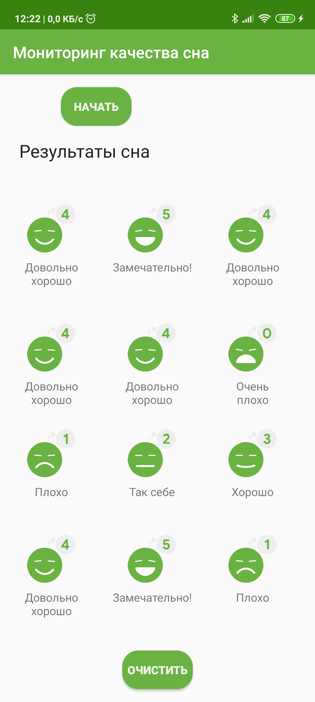
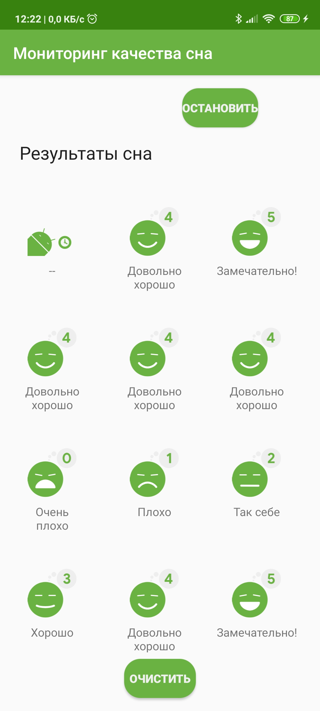
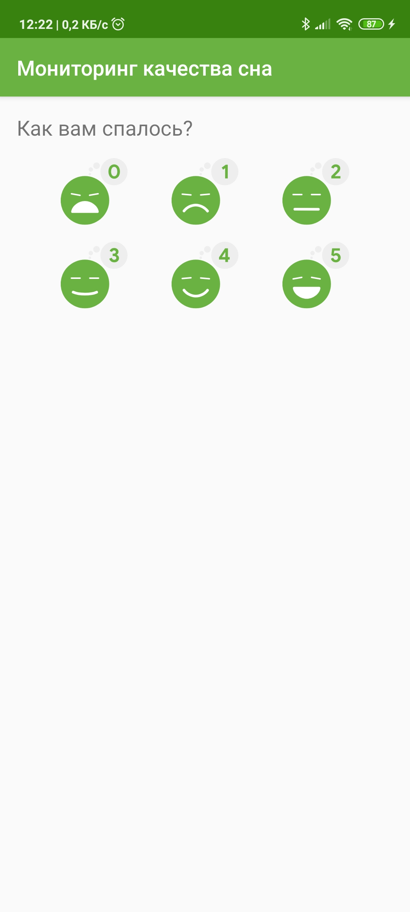
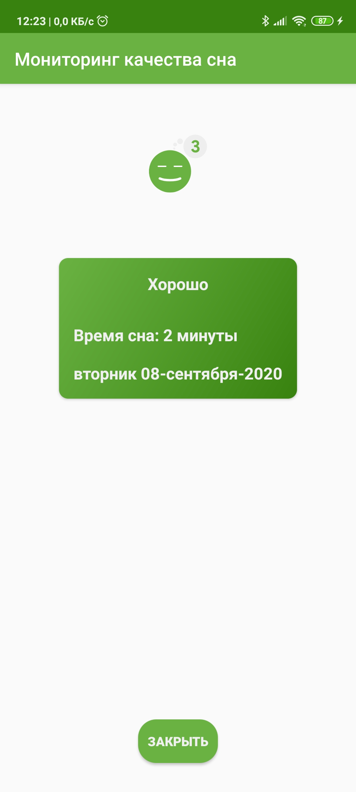

## SleepQualityTracker

Приложение Sleep Quality Tracker - это демонстрационное приложение, которое помогает вам собирать информацию о вашем сне.
* Дата начала сна
* Качество сна
* Время сна

Это приложение демонстрирует следующие взгляды и методы:
* Room
* DAO
* Coroutines

Он также использует и развивает следующие методы :
* Transformation map
* Data Binding in XML files
* ViewModel Factory
* Using Backing Properties to protect MutableLiveData
* Observable state LiveData variables to trigger navigation

## Screenshots

